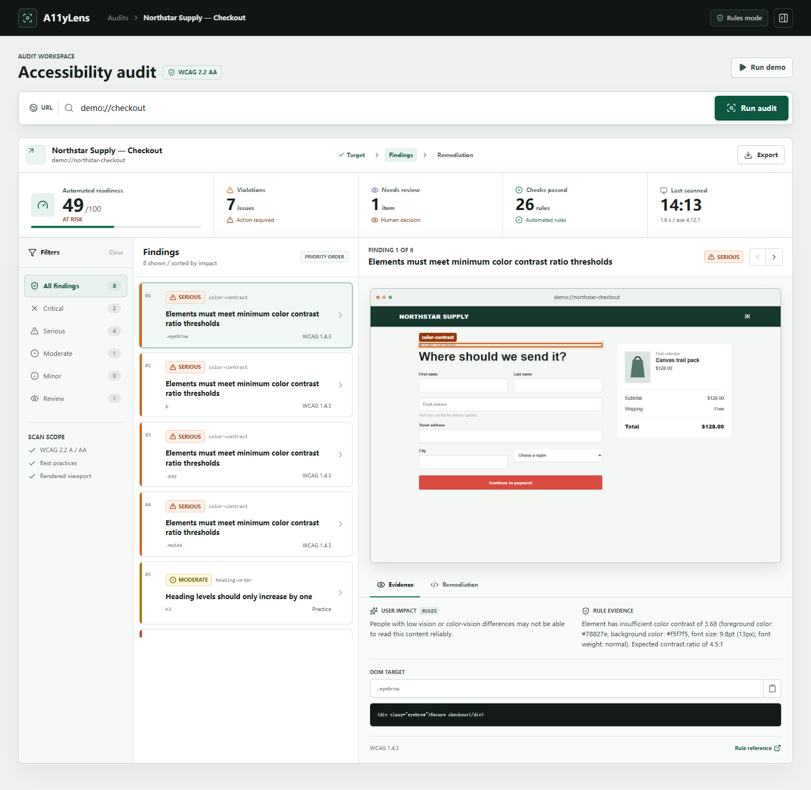
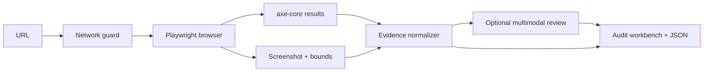

# A11yLens

Evidence-first accessibility audits for rendered web applications.



A11yLens combines deterministic `axe-core` checks, rendered-page evidence, and an optional multimodal AI review. Every finding keeps its selector, DOM fragment, screenshot location, rule reference, remediation example, and validation step together.

> A11yLens is an engineering aid, not a WCAG conformance certificate. Automated and AI-assisted findings still require review by people who understand how disabled users interact with the product.

## What works

- Real Chromium page capture at a stable 1440 × 900 viewport
- WCAG 2.2 A/AA and best-practice checks powered by `axe-core`
- Screenshot overlays linked to the affected DOM node
- Evidence, user impact, remediation, and validation views
- JSON report export
- Optional OpenAI-compatible multimodal analysis with a rules-only fallback
- DNS and request guards that block private-network targets by default
- Responsive audit workbench and built-in `demo://checkout` target

## Quick start

Requirements: Node.js 20+ and pnpm.

```bash
pnpm install
pnpm dev
```

Open [http://127.0.0.1:4173](http://127.0.0.1:4173). The built-in checkout audit runs automatically.

A11yLens reuses Microsoft Edge or Google Chrome on Windows. On other systems, install the Playwright browser once:

```bash
pnpm exec playwright install chromium
```

## Optional AI review

Copy `.env.example` values into your environment and set:

```bash
A11YLENS_AI_API_KEY=...
A11YLENS_AI_MODEL=your-vision-model
A11YLENS_AI_BASE_URL=https://your-compatible-endpoint/v1
```

The scanner sends a low-detail screenshot plus the first twelve normalized findings to one multimodal request. If the endpoint fails or is not configured, the report falls back to deterministic explanations.

## Local targets

Private addresses are blocked because a URL scanner can otherwise become an SSRF primitive. For trusted local development only, explicitly opt in:

```bash
pnpm exec cross-env A11YLENS_ALLOW_PRIVATE_TARGETS=true pnpm dev
```

Do not enable this on a public deployment.

## Architecture



The AI layer does not create or suppress deterministic violations. It may add contextual user-impact and remediation language while preserving the original rule evidence.

## Verification

```bash
pnpm typecheck
pnpm test
pnpm build
pnpm lint
```

The current test suite covers private-network filtering, readiness scoring, remediation lookup, and stable demo fixtures.

`work/capture-ui.mjs` performs desktop and mobile browser QA at 1440 px and 390 px. It checks layout width, screenshot loading, finding navigation, the remediation workflow, and runs an axe self-audit against the A11yLens interface.

## Near-term roadmap

- GitHub Action with SARIF upload
- Multi-route crawl with a page budget
- Keyboard path and focus-order capture
- React/Vue source patch generation in local mode
- Human-review queues and issue suppression history
- Reproducible benchmark pages for semantic accessibility defects

## License

MIT
